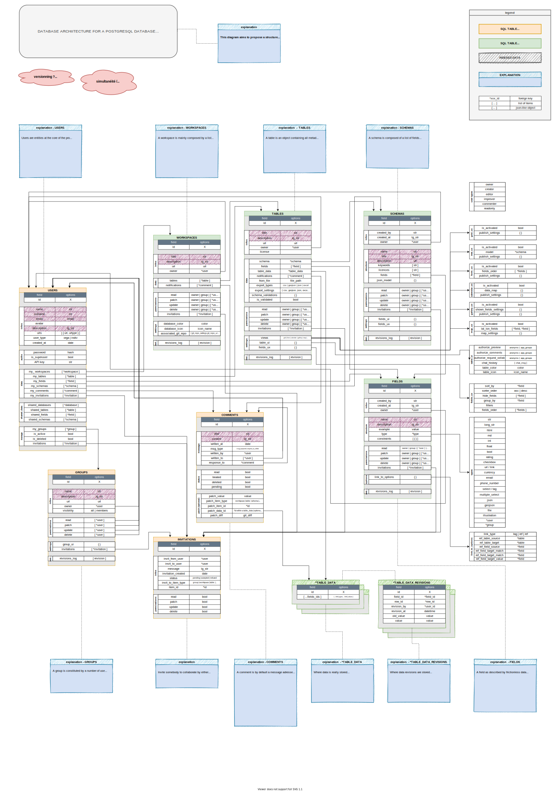

# DATA PATCH - DMS BACKEND PROJECT

A simple boilerplate of an API server for [CRUD][CRUD_def] operations, powered by **[FastAPI][fastapi]** framework with a **PostgreSQL** database. 

This work in progress is mainly the result of studying [tutorials][fastapi-tuto] from official documentation, the [amazing fullstack FastAPI-PostgreSQL boilerplate][fastapi-boilerplate], and this [tutorial playlist by MK Fast][MK-Fast] on youtube.

## Features

The current goal is to make it work with the following generic features, so it could be adapted for later purposes :

- [x] **PostgreSQL** database for storing large volumes of data,  keeping track of relations, and making queries in a simple way (easier than MongoDB at least)  ;
- [x] **Oauth2** authentication for securiity and users management ;
- [ ] **SocketIO** endpoints for collaborative work ;
- [ ] **Email notifications** for password changes ;
- [ ] **Static files** server for avatars and so...
- [ ] **Testing** wiith [Pytest][pytest], for development ;
- [x] **CORS** implementation, to serve as SAAS API server ;
- [ ] **Dockerisation**, for dev purposes...

## Datamodel & documentation

Check more about the endgame [here](docs/README.md).

---

# INSTALLATION

<!-- ## 1/ Virtual env python -->

<!-- ```shell
pip install virtualenv
virtualenv env
source venv/bin/activate
``` -->

## Dependencies - PostgreSQL

- ubuntu

```shell
sudo apt-get install postgresql postgresql-contrib
sudo -u postgres psql -c "SELECT version();"
```

- mac OS


cf : https://gist.github.com/ibraheem4/ce5ccd3e4d7a65589ce84f2a3b7c23a3
cf : https://www.codementor.io/@engineerapart/getting-started-with-postgresql-on-mac-osx-are8jcopb

```shell
brew doctor
brew update
brew install postgres
brew services start postgresql
```
<!-- ln -sfv /usr/local/opt/postgresql/*.plist ~/Library/LaunchAgents -->

---

## Dependencies - Python

<!--
```shell
python -m pip install --upgrade pip
pip install -r requirements.txt
``` -->

We use [`pipenv`][pipenv] as package manager :

```shell
pipenv install --dev
# or
pipenv install --system --dev
```

or

```shell
pipenv install --three python-dotenv fastapi uvicorn sqlalchemy  sqlalchemy-utils pydantic[email] psycopg2 alembic python-multipart python-jose[cryptography] passlib[bcrypt] aiofiles fastapi-socketio requests inflect shutil pytest
```

To print requirements :
```shell
pipenv shelll
pipenv run pip freeze
```

To reead more on [why pipenv](https://realpython.com/pipenv-guide/) or [here in french](https://sametmax.com/pipenv-solution-moderne-pour-remplacer-pip-et-virtualenv/)...

---

## Environment variables

### The .env file

The environment variables must be stored in the `.env` file at the root of the repo. It contains confidential values such as : postgres url with password, email smtp values, JWT secret keys... 

A template - `example.env` - is present at the root. You can copy-paste it and customize it wiith your own values.

```shell
# from repo root
cp example.env .env
```

### Create secure random keys

To generatte random secret keys you  can use `openssl` command line or - if you feel lazy - [password generator website](https://passwordsgenerator.net/).

```shell
openssl rand -hex 32
```

... and copy-paste the key as `JWT_SECRET_KEY` in `.env` file


---

# RUNNING APP

## Run app

Once you had cloned the repo and installed dependencies (postgreSQL server, and python packages with pipenv) you can run the app with thiis command line :

```shell
alembic upgrade head && pipenv run uvicorn sql_app.main:app --reload
```

then open the  following url in your browser `http://localhost:8000/docs`

---

## Migrations 

We use [Alembic][alembic] for migrations.

```shell
alembic revision --autogenerate -m "<Migration message>"
alembic upgrade head
```

cf : https://alexvanzyl.com/posts/2020-05-24-fastapi-simple-application-structure-from-scratch-part-2/

---

## Tests

We use [Pytest][pytest] for testing (see also [FastAPI pytest tutorial][fastapi-tests]).

```shell
pytest
```

---

## Datamodel (goal)

The current goal - better to say the endgame - is to be able to agnostically manage datasets in the same way Baserow or airtable can. Such datamodel should include the following concepts : 

```
.
├── <user related>
│   ├── users (usual infos as email, pwd, ... + groups + owned or shared datasets/)
│   ├── groups (groups of users + auth levels attributions)
│   ├── comments (similar to a notification)
│   └── invitations
│
├── <data related>
│   ├── workspaces (collection of tables/datasets)
│   ├── tables (dataset's metadata)
│   ├── table_data (as many sql tables there is of created datasets)
│   ├── fields (field descriptions that could be used in several datasets)
│   └── schemas (collections of fields)

```

The following illustration gives an idea of the endgame datamodel we aim for....



---

[CRUD_def]:https://en.wikipedia.org/wiki/Create,_read,_update_and_delete
[fastapi]:https://fastapi.tiangolo.com/
[fastapi-tuto]:https://fastapi.tiangolo.com/tutorial/
[fastapi-boilerplate]:https://github.com/tiangolo/full-stack-fastapi-postgresql
[MK-fast]:https://www.youtube.com/watch?v=HnJEiTx0feE&list=PL_9Bx_sxJkROtrlVTsGiuu-NtO_BmUfkB

[pipenv]:https://pipenv-fork.readthedocs.io/en/latest/basics.html
[alembic]:https://alembic.sqlalchemy.org/en/latest/
[pytest]:https://docs.pytest.org/en/stable/
[fastapi-tests]:https://fastapi.tiangolo.com/tutorial/testing/
